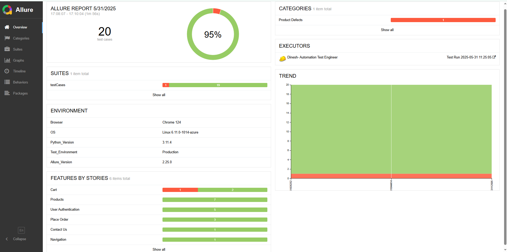

# Selenium Python Automation Framework for AutomationExercise.com

<!--  -->


Welcome to my **Selenium Python Automation Framework**! This project is designed to showcase **real-world test
automation** concepts and practices. It's a learning reference for anyone looking to get started with Selenium, Python,
and Pytest for UI test automation.

A scalable and easy-to-maintain **Selenium automation framework** built using **Python**, **Pytest**, and the **Page
Object Model (POM)** design pattern. This project automates real-world e-commerce flows
on [AutomationExercise.com](https://automationexercise.com) and demonstrates CI/CD, Allure reports, and headless browser
execution.

---

## What You Will Learn

This project is a hands-on learning resource where you can explore:

- **Setting up a Selenium automation framework with Python**: Learn how to set up and configure Selenium WebDriver with
  Python.
- **Page Object Model (POM)**: Understand how the Page Object Model design pattern makes your tests more maintainable and
scalable.
- **Organizing tests with Pytest**: Discover how to use Pytest for running tests, creating fixtures, and grouping related
tests.
- **Practical Test Cases**: Explore real-world test cases such as login, product search, and adding items to a shopping cart.
- **Test Automation Best Practices**: Learn automation best practices such as modular test case creation, efficient data
handling, and reporting.

---

## Features

- Full automation for e-commerce user flows
- Login, Registration, and Logout simulation
- Product Search and Filter tests
- Add to Cart and Checkout simulation
- Page Object Model (POM) design pattern for test organization
- Pytest-based test suite with fixtures
- **Allure reporting** integration for professional test results
- **Headless browser execution** support
- **GitHub Actions CI/CD** for automatic test runs
- Modular, scalable, and easy to extend
- Dynamic Test environment selection ie, staging, qa, production
- Automatic screenshot capture on test failures
- Action-level logging for every interaction with the application under test
- Learning Resource as reference for beginners 

---

## Tech Stack

- **Language:** Python 3.8+
- **Automation Tool:** Selenium WebDriver
- **Test Framework:** Pytest
- **Design Pattern:** Page Object Model (POM)
- **Reports:** Allure
- **CI/CD:** GitHub Actions
- **Execution Mode:** Headless (Chrome)

---

## Project Structure

```
automation-exercise-webapp/
├── .github/              # GitHub workflows
├── .pytest_cache/        # Pytest cache (auto-generated)
├── allure-results/       # Allure result files (ignored by Git)
├── assets/               # Images or other static assets for readme.md (Optional)
├── configurations/       # Environment-specific configs (e.g. staging, qa)
├── data/                 # Test data files (CSV, JSON, etc.)
├── logs/                 # Execution logs
├── pageObjects/          # Page Object classes (POM design pattern)
├── resources/            # Additional reusable test files
├── screenshots/          # Screenshots on test failures (auto-captured)
├── testCases/            # Test scripts written using Pytest
├── utilities/            # Helper modules and utilities
├── venv/                 # Python virtual environment (not tracked in Git)
├── conftest.py           # Pytest fixtures and hooks
├── pytest.ini            # Pytest configuration file
├── requirements.txt      # List of project dependencies
└── README.md             # Project documentation

```

---

## Test Cases Overview
This repository contains automated tests that validate various features of the automationexercise.com application.
Here you can find the detailed testcases: https://docs.google.com/spreadsheets/d/1NUxqXTgNuichaF1jcYwfu4PFWOOiKpK-FEF60RkuZe4/edit?gid=0#gid=0 

---

## Test Plan Overview
### Test Strategy
This test automation framework focuses on end-to-end functional testing, ensuring the core features of the application
are validated:

- **Functional Testing:** Verifying that each functionality, such as login, search, and checkout, works as expected.
- **Regression Testing:** Ensuring that recent updates do not break existing functionality.

### Test Coverage
The test cases cover the following features:

- **User Authentication:** Login, Registration, Logout
- **Product Search:** Search functionality for products
- **Shopping Cart:** Add/remove products from the cart and proceed to checkout

---

## Setup Instructions

To get started with this project, follow these steps:

### 1. Clone the Repository
`git clone https://github.com/dinesh-qadev/automation-exercise-webapp.git`

### 2. Set Up a Virtual Environment

If pycharm is an IDE, It automatically suggests creating a virtual environment when you create a new project. Here is
how to Set Up a Virtual Environment Manually (General Steps):
- Open your terminal or command prompt.
- Navigate to your project folder.
- Run:

`python -m venv venv`

- Activate the environment:

`.\venv\Scripts\activate`
  

### 3. Install Dependencies

Before running the tests or the application, you need to install the required Python packages. Install the required
packages listed in the requirements.txt file using `pip`:

`pip install -r requirements.txt`

This will install all necessary libraries such as Selenium, pytest, and any other dependencies specified.

---

## Running Tests
Make sure Python, pip, and Allure are installed and added to your PATH.

**Run Full Test Suite (Headless Mode)**

`pytest --env=production`

OR also can be just run by

`pytest`

**Run Full Test Suite (Non-Headless With GUI)**

`pytest --headed --env=production`

OR also can be just run by

`pytest --headed`

**Run a Specific Test Case (Example: test_017)**

`pytest -s -k test_017_remove_products_from_cart.py`

**Generate & View Allure Report After Test Run**

**Option 1: Generate and View report from Local**

`allure generate reports --clean -o allure-report`

`allure open allure-report`

**Option 2: View Live on GitHub Pages**

The latest Allure report is automatically generated and published with each test run via GitHub Actions.

**[Click here to view the latest Allure Report](https://dinesh-qadev.github.io/automation-exercise-webapp/allure-report/)**

**Option 3: View Locally from GitHub Actions Artifact**

Step 1: Download the allure-report artifact from the GitHub Actions run.

Step 2: Extract the downloaded `.zip` file.

Step 3: Locate `index.html` file and open it on browser. If the report is broken or not loaded on browser, do the
following steps.

Step 3.1: Open your terminal and navigate into the extracted folder or go to the extracted folder and open cmd.

Step 3.2: Start a local server using Python:

`python -m http.server 8000`

Step 3.3: Open your browser and go to:

`http://localhost:8000`

**Run Tests in Specific Environments (Dynamic Environment Selection)**

This framework supports dynamic test environment selection via `--env` command-line flag. It uses environment-specific
base URLs configured in `config.py`. If no any env is selected then production will be taken as default.

`pytest --env=production`

For Staging- `--env=staging`

For QA- `--env=qa`

For Production- `--env=production`

**Clean Allure Report Data Locally**

`if (Test-Path .\allure-results) { Remove-Item .\allure-results -Recurse -Force }`

`if (Test-Path .\allure-report)  { Remove-Item .\allure-report -Recurse -Force }`

`if (Test-Path .\allure-history) { Remove-Item .\allure-history -Recurse -Force }`

---
## Screenshots & Reports

Below are visuals that demonstrate the execution, reporting, and CI workflow of this automation framework.

### Allure Report Dashboard

This dashboard provides a detailed view of test results, including categories, executors, and attachments



---

### Failed Test Case View in Allure

Clearly shows failed steps, exception stack trace, screenshot of failure screen, and logs captured during a failed test run.


---

### Allure Graphs and Trends

Graphs showing test execution trends and flaky test detection over multiple runs.


---

### Test Timeline

View a timeline of all tests and parallel executions, useful for performance analysis.


---

### Passed Test with Logs and Steps

Detailed step-by-step view of a passed test with logs and status for each action.


---

### GitHub Actions CI Workflow

This project is integrated with GitHub Actions to run tests on every push and pull request.


---

### CI Test Run Screenshot

Shows the execution of automated tests in CI through GitHub Actions.


---

### Artifacts Collected During Test Run on Git Action Workflow

Includes logs, screenshots, and environment details captured as test artifacts.


---

## Notes

- All screenshots were captured from real executions of this framework.
- Artifacts and reports are stored in `allure-results/` and can be viewed with Allure locally.

---

## Author
**Dinesh** –[@dinesh-qadev](https://github.com/dinesh-qadev)

Blog: [https://dineshjoshi.com.np](https://dineshjoshi.com.np)

QA Engineer | Automation Test Engineer | Blogger

Feel free to connect and share feedback or suggestions!

🔎 Keywords (SEO)
Selenium Python Framework, AutomationExercise Test Automation, Page Object Model in Python, Pytest Selenium Example,
Python Automation Testing Framework, Real-world Selenium project, Test Automation GitHub Example